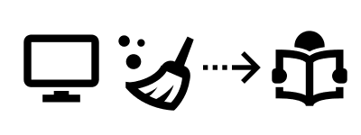
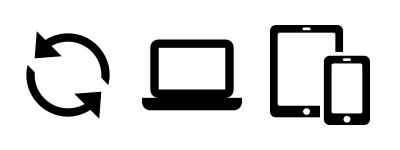

Title: Features
sortorder: 20

    

      

      

        Save webpages, cleaned for better experience
      

    

    

      

      

        Access content from everywhere with mobile apps
      

    

    

      

      

        Organise content: tags, favorite, filters, &hellip;
      

    

    

      

      

        wallabag is open-source, and you can install it yourself
      

    

    

      

      

        Compatibility : import from your bookmarks or any other service
      

    

## Detailed features

We published [a roadmap for wallabag 2.0]({filename}roadmap.md), don't forget to have a look on it.

* wallabag is free and open source. Forever.
* No time to read? Save a link in your wallabag to read it later
* Read the saved articles in a comfortable view: the content, only the content. Get rid of the ads and menus.
* Save all the content: text and pictures
* You can easily migrate from other proprietary services : welcome to you, Pocket / Readability or Instapaper users! Also, you can import * your browser bookmarks.
* You like an article? There's many ways to share it, featuring email, twitter or shaarli
* Because we are increasingly mobile, the wallabag interface fits all your devices
* Saving a link is so easy because we provide you with many tools: extensions for Chrome and Firefox, iOS, Android, Firefox OS and Windows Phone application, a bookmarklet, a simple field in your config webpage
* RSS feeds allow you to read your saved links in your RSS aggregator
* You have an e-reader? wallabag can export all kind of entries to ePub, Mobi & PDF formats.
* You can set as many  tags you like to your entries
* It is possible to search through title and content of articles
* wallabag is multilingual: french, english, spanish, german, italian, russian, persian, czech, polish, ukrainian and slovenian
* Keyboard shortcuts ! Lots of them !
* You’re not the only one at home to use wallabag? that’s fine, wallabag is multi-user
* Prefer a dark template? Perfect, many templates are available in the configuration screen
* Many storage systems allowed: sqlite, mysql and postgresql
* Scroll position is saved: when you return to an article, you come back where you were. So convenient!
* You can flattr flattrable articles directly from your wallabag
* You want to retrieve your wallabag data? Hey, remember, wallabag is open source, you can export it

## Screenshots

Pictures (except wallabag screenshots) used in this page come [from icons8.com](https://icons8.com/).
